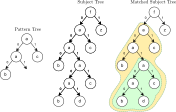

# Algorithm D
An implementation of Algorithm D as described in 
[Pattern Matching in Trees](https://www.cs.purdue.edu/homes/cmh/distribution/papers/PatternMatching/PatternMatchingInTrees.pdf) 
by Hoffmann and O'Donnell.
This implementation is in OCaml, as it powers the demo on my [blog article](https://compiler.club/pattern-matching-in-trees/) about 
this algorithm. A Java version of the same can be found [here](https://github.com/contificate/algorithm-d).

The algorithm works by constructing an Aho-Corasick automaton for a set of root-to-leaf "path strings"
from the pattern tree(s). Then, the subject tree is traversed using a traversal stack.
At each output, the match length can be used to index the traversal stack to find the relevant subtree (where a match is rooted).
If, by the end, the number of path string matches equals the number of path strings, then there's a match.
